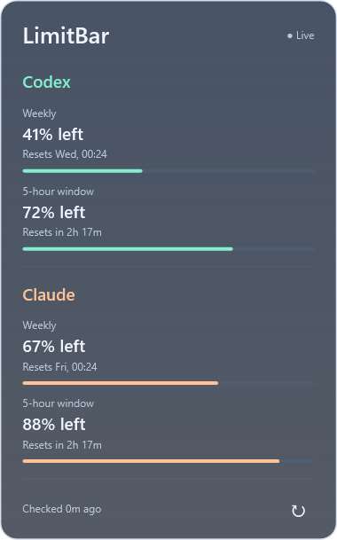
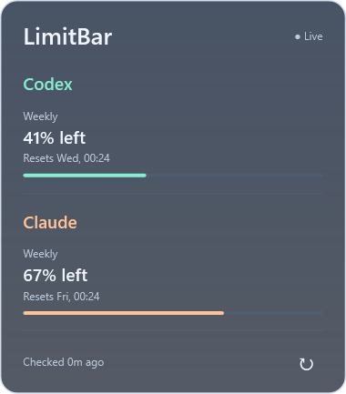

# LimitBar

**Your AI coding limits, one glance away.**

LimitBar puts Codex and Claude subscription usage on your Windows taskbar. See what is left, hover for reset times, and get back to work.

[Download for Windows](https://github.com/ibneturabhassan/LimitBar/releases) · [Setup guide](docs/windows-setup.md) · [Contribute](CONTRIBUTING.md) · [Report a bug](https://github.com/ibneturabhassan/LimitBar/issues/new/choose)

https://github.com/user-attachments/assets/18d05135-b117-484a-9b92-1e78bb2277f0

*Actual app UI with sample readings, arranged on an illustrative desktop background. No personal account data is shown.*

## Why this exists

Checking a usage limit should not interrupt the work you are doing. When you use more than one coding assistant, the remaining quota and reset time are spread across different apps and account screens.

LimitBar started as a personal Windows utility to keep those numbers visible. A small taskbar overlay makes them glanceable; a hover card adds detail only when you need it. No browser tab to keep open, no dashboard to switch to, and no system tray icon to hunt for.

It is a native .NET app: Windows Forms handles the small taskbar overlay, and WPF renders the translucent popup and automatically sized text. There is no Electron runtime, hosted backend, or LimitBar account.

## What it does

- Shows Codex and Claude on two stacked taskbar lines.
- Displays **weekly remaining**, optional **session remaining**, then **time until reset**.
- Opens a translucent details card above the meter on hover.
- Hides session sections when the provider does not report a session limit.
- Refreshes automatically, checks after sleep, and backs off when requests fail.
- Labels old readings as stale; an elapsed countdown does not pretend the quota has reset.
- Supports dragging, optional startup with Windows, and small reset/low-usage notification tips.

Example: `Codex 41% (72%) · 2h 18m` means **41% weekly remaining**, **72% session remaining**, and **2 hours 18 minutes until the session resets**. Without session data, the countdown refers to the weekly window.

## Install on Windows

1. Download `LimitBar-<version>-win-x64-setup.exe` from [Releases](https://github.com/ibneturabhassan/LimitBar/releases). Start with the newest beta.
2. Run the installer. It installs for your Windows user and includes the .NET runtime.
3. Install and sign into the provider CLI you use: [Codex CLI](https://developers.openai.com/codex/cli) and/or [Claude Code](https://code.claude.com/docs/en/setup).
4. Open a **Windows PowerShell** window and run `codex login` and/or `claude auth login`.
5. Launch **LimitBar** from Start. Wait for the first reading, then drag the meter to an unused area of the taskbar.
6. Hover for details. Right-click for **Refresh now**, **Start with Windows**, **Notifications**, or **Exit LimitBar**.

The [step-by-step Windows guide](docs/windows-setup.md) covers installation, provider setup, portable use, updates, uninstalling, and troubleshooting.

**Beta requirements:** Windows 11 x64, a primary horizontal taskbar, and an eligible signed-in provider account. Provider CLIs must be installed in Windows, not only inside WSL. API-key billing balances are not supported. ARM64 is not tested.

**Unsigned release:** the initial community builds are not code-signed. Windows may show an unknown-publisher or reputation warning. Download only from this repository's Releases page; checksums are provided. Signing is on the roadmap.

## Screenshots

| Full details | Weekly-only accounts |
| --- | --- |
|  |  |

These are renders of the real controls using synthetic data. Generate them locally with `dotnet run --project LimitBar.Desktop -- --screenshots`.

## How account access works

**Codex:** LimitBar starts a short-lived `codex app-server` and reads the signed-in account's rate limits. It sends no model prompts. The Codex CLI owns sign-in. LimitBar uses the Codex quota bucket when available; model-specific buckets are not displayed.

**Claude — experimental:** LimitBar reads the existing Claude Code OAuth access token from the local credentials file and sends it only to Anthropic's usage endpoint, with redirects disabled. That endpoint is internal and can change. Expired credentials must be refreshed by Claude Code. This is an unofficial integration, not a supported public Claude usage API.

LimitBar has no telemetry or server of its own. It does not write or log provider credentials. Usage requests still reach the provider through its CLI or API. Read [privacy and security](SECURITY.md) before using it.

LimitBar is an independent community project, not affiliated with OpenAI or Anthropic.

## Current boundaries

This is an **overlay**, not a taskbar extension. It does not reserve space, replace the weather widget, or rearrange Windows buttons. Drag it somewhere free. It hides for fullscreen applications and when the taskbar is off-screen.

Secondary/vertical taskbars, native ARM64 builds, automatic updates, and a built-in sign-in flow are not included in this beta. The popup is translucent; it does not apply backdrop blur. Settings are stored in `%LOCALAPPDATA%\LimitBar\settings.json`.

## Build from source

Install the [.NET 8 SDK](https://dotnet.microsoft.com/download/dotnet/8.0), then:

```powershell
git clone https://github.com/ibneturabhassan/LimitBar.git
cd LimitBar
dotnet build LimitBar.slnf
dotnet run --project LimitBar.Desktop
```

Run offline checks:

```powershell
powershell -NoProfile -File scripts/verify.ps1
```

Build the self-contained installer and portable ZIP:

```powershell
powershell -NoProfile -File scripts/release.ps1
```

The release script downloads a checksum-pinned Inno Setup compiler into ignored `artifacts/tools/`, runs checks, and writes versioned packages plus SHA-256 checksums. See [release maintenance](docs/releases.md).

`LimitBar.slnf` selects the supported projects. The full solution retains unfinished Windows Widgets experiments; they are not part of the desktop release.

## Contributions welcome

Bug reports, documentation fixes, UI polish, and provider compatibility improvements are welcome. See [CONTRIBUTING.md](CONTRIBUTING.md) for the project layout, checks, and pull request expectations. Open an issue before taking on a large feature so we can agree on scope.

Useful areas to help: mixed-DPI/multi-monitor behavior, keyboard accessibility, supported provider integrations, signed releases, and ARM64 testing.

## License

[MIT](LICENSE). Bundled runtime and build-tool notices are documented in [THIRD-PARTY-NOTICES.md](THIRD-PARTY-NOTICES.md).
