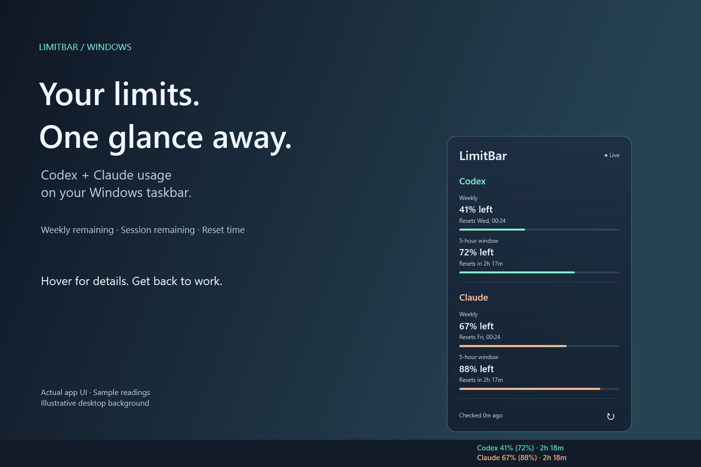

# Windows setup

## 1. Download and install

Go to [LimitBar Releases](https://github.com/ibneturabhassan/LimitBar/releases) and choose the newest beta. Download the file ending in `win-x64-setup.exe`, not GitHub's source-code archive.

The installer includes the .NET runtime. You do not need Visual Studio, the .NET SDK, or Node.js to run LimitBar itself. Provider CLIs are separate prerequisites.

Run the installer and choose a location. The default is `%LOCALAPPDATA%\Programs\LimitBar`. A Start menu shortcut is created; a desktop shortcut is optional. Administrator access is not required.

Initial builds are unsigned. If Windows blocks the download, verify that it came from this repository. Do not disable Windows security features. You can inspect or build the source instead.

Optional integrity check, in the download folder:

```powershell
Get-FileHash .\LimitBar-0.1.0-beta.1-win-x64-setup.exe -Algorithm SHA256
```

Compare the result with `SHA256SUMS.txt` from the same release. A checksum detects a damaged or mismatched download; it is not a publisher signature.

## 2. Connect the accounts you use

You may use either provider or both. An unconfigured provider displays an offline status. Hiding an entire provider is not yet implemented.

### Codex

1. Install [Codex CLI using the official Windows instructions](https://developers.openai.com/codex/cli).
2. Open a new Windows PowerShell window.
3. Confirm the command is available and sign in:

   ```powershell
   codex --version
   codex login
   ```

4. Complete the browser sign-in with your ChatGPT account. API-key authentication does not provide the subscription limits that LimitBar needs.
5. Restart LimitBar if it was open before the CLI was installed, so it picks up the updated `PATH`.

The Codex desktop app alone is not sufficient if the `codex` CLI is unavailable in Windows PowerShell.

### Claude (experimental)

1. Install [Claude Code for native Windows](https://code.claude.com/docs/en/setup), including any prerequisites described there.
2. Open a new Windows PowerShell window and run:

   ```powershell
   claude --version
   claude auth login
   ```

3. Complete the sign-in with an account that reports usage windows.
4. In LimitBar, right-click the meter and select **Refresh now**.

LimitBar expects Claude Code's file-based credentials at `%USERPROFILE%\.claude\.credentials.json`, or the directory set by `CLAUDE_CONFIG_DIR`. A WSL-only sign-in or another credential store is not read automatically. Do not copy tokens into issues, configuration examples, or chat.

If the sign-in expires, open Claude Code to let it refresh the credentials, or sign in again, then refresh LimitBar. LimitBar does not refresh Claude credentials itself.

## 3. Use the meter

Launch **LimitBar** from the Start menu. Allow up to about 20 seconds for the first provider request.



- **Read:** weekly remaining first; session remaining in parentheses; reset countdown last.
- **Hover:** the details card opens directly above the meter. Move into it to inspect the readings or use refresh.
- **Move away:** the card closes after a short grace period.
- **Click:** opens and activates the card.
- **Drag:** hold the left mouse button on the meter and move horizontally to an empty taskbar area.
- **Right-click:** refresh, reset the position, toggle notification tips/startup, or exit.
- **Escape:** dismisses the active card.

No system tray icon is created. Use the meter's right-click menu to exit.

A missing session is hidden entirely. `Reset due` means the timestamp has passed, but a fresh response has not confirmed the new quota. Gray values labeled **Stale reading** are the last successful reading, not a current guarantee.

## 4. Start with Windows

Right-click the meter and enable **Start with Windows**. This adds an entry for your user under `HKCU\Software\Microsoft\Windows\CurrentVersion\Run`. Disable it from the same menu.

For portable use, move the app to its permanent folder **before** enabling startup.

## Portable ZIP

Download the `win-x64-portable.zip` release asset. Extract the entire archive into a permanent folder, then run `LimitBar.Desktop.exe`. Keep all accompanying files together.

The portable package still stores preferences in `%LOCALAPPDATA%\LimitBar`; it is portable in installation, not in settings storage.

## Update and uninstall

There is no automatic updater yet. Right-click **Exit LimitBar**, download the newer installer, and install to the same location. The installer asks you to close an active instance. Preferences are retained.

For a portable update, exit, extract the new ZIP into a new folder, then toggle startup off/on if its path changed.

Uninstall an installed copy through **Settings → Apps → Installed apps → LimitBar → Uninstall**. Exit the meter first. The uninstaller removes its startup entry if it still points to that installation. Preferences are retained; remove `%LOCALAPPDATA%\LimitBar` manually if you want a complete reset. Provider accounts and credentials are never removed.

## Troubleshooting

| Symptom | What to check |
| --- | --- |
| Meter is missing | Leave fullscreen mode, reveal the taskbar, check the primary display, and make sure LimitBar is running. |
| It overlaps Windows buttons | Drag it to a free space. The overlay cannot reserve taskbar space. |
| Codex is offline | Run `codex --version` and `codex login` in Windows PowerShell, then restart LimitBar. |
| Claude is offline | Run `claude auth login`; check native Windows credential storage. The internal endpoint may also be unavailable or rate-limited. |
| No session row | The provider did not return a session percentage. This is expected on some accounts. |
| Values do not change immediately | Normal refresh is every three minutes. Failures back off to at most 24 minutes; use **Refresh now** to retry. |
| Reset time passed but quota stayed low | Wait for fresh provider data; the clock alone cannot confirm replenishment. |
| A bug persists | [Open an issue](https://github.com/ibneturabhassan/LimitBar/issues/new/choose) with Windows version, display scale, LimitBar version, and redacted screenshots. Never attach credentials. |
